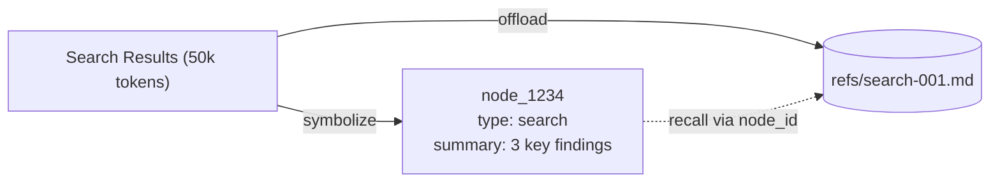

# tencentdb-agent-memory

> Skill by [ara.so](https://ara.so) — AI Agent Skills collection.

## What It Does

TencentDB Agent Memory provides **fully local** long-term memory for AI agents through a 4-tier progressive pipeline:

- **L0 Conversation**: Raw dialogue logs
- **L1 Atom**: Atomic facts extracted from conversations
- **L2 Scenario**: Scene blocks aggregated from atoms
- **L3 Persona**: User profile distilled from scenarios

It combines **symbolic short-term memory** (Mermaid canvas offloading) with **layered long-term memory** (persona/scenario pyramid) to:

- Cut token usage by up to **61.38%** (WideSearch benchmark)
- Improve task success by up to **51.52%** relative (WideSearch)
- Boost PersonaMem accuracy from **48%** to **76%**

**Zero external API dependencies** — runs entirely on local SQLite + sqlite-vec.

## Installation

### For OpenClaw

```bash
# Install the plugin
openclaw plugins install @tencentdb-agent-memory/memory-tencentdb

# Restart the gateway
openclaw gateway restart
```

### For Hermes (Docker)

```bash
# Build the image
docker build -f Dockerfile.hermes -t hermes-memory .

# Run with your LLM credentials
docker run -d \
  --name hermes-memory \
  --restart unless-stopped \
  -p 8420:8420 \
  -e MODEL_API_KEY="${YOUR_API_KEY}" \
  -e MODEL_BASE_URL="https://api.lkeap.cloud.tencent.com/v1" \
  -e MODEL_NAME="deepseek-v3.2" \
  -e MODEL_PROVIDER="custom" \
  -v hermes_data:/opt/data \
  hermes-memory
```

### As a Standalone Library

```bash
npm install @tencentdb-agent-memory/memory-tencentdb
```

```typescript
import { TencentDBMemory } from '@tencentdb-agent-memory/memory-tencentdb';

const memory = new TencentDBMemory({
  storage: {
    type: 'sqlite',
    dbPath: './data/memory.db'
  }
});

await memory.initialize();
```

## Configuration

### OpenClaw Zero-Config (Minimal)

```jsonc
// ~/.openclaw/openclaw.json
{
  "memory-tencentdb": {
    "enabled": true
  }
}
```

### Enable Short-Term Compression

```jsonc
{
  "memory-tencentdb": {
    "enabled": true,
    "config": {
      "offload": {
        "enabled": true
      }
    }
  },
  "plugins": {
    "slots": {
      "contextEngine": "openclaw-context-offload"
    }
  }
}
```

Then apply the runtime patch:

```bash
bash scripts/openclaw-after-tool-call-messages.patch.sh
```

### Full Configuration Schema

```jsonc
{
  "memory-tencentdb": {
    "enabled": true,
    "config": {
      // Storage backend
      "storage": {
        "type": "sqlite",  // or "postgres"
        "dbPath": "./data/memory.db",
        // For PostgreSQL:
        // "host": "localhost",
        // "port": 5432,
        // "database": "agent_memory",
        // "user": "postgres",
        // "password": "${POSTGRES_PASSWORD}"
      },
      
      // LLM for memory extraction
      "llm": {
        "provider": "custom",
        "apiKey": "${LLM_API_KEY}",
        "baseURL": "https://api.lkeap.cloud.tencent.com/v1",
        "model": "deepseek-v3.2"
      },
      
      // Embedding model (local by default)
      "embedding": {
        "provider": "local",  // or "openai"
        "model": "Xenova/all-MiniLM-L6-v2",
        "dimension": 384
      },
      
      // Memory extraction control
      "memory": {
        "autoExtract": true,
        "extractInterval": 10,  // Extract every 10 messages
        "personaUpdateThreshold": 50  // Update persona after 50 atoms
      },
      
      // Short-term offload
      "offload": {
        "enabled": true,
        "maxContextTokens": 100000,
        "compressionRatio": 0.3
      },
      
      // Recall settings
      "recall": {
        "topK": 5,
        "similarityThreshold": 0.6,
        "includePersona": true,
        "includeScenarios": true
      }
    }
  }
}
```

## Core Concepts

### Memory Layers

```
L3 Persona (user profile, preferences)
    ↑ aggregates from
L2 Scenario (scene blocks, common patterns)
    ↑ extracts from
L1 Atom (atomic facts)
    ↑ distills from
L0 Conversation (raw dialogue)
```

### Symbolic Memory (Mermaid Canvas)

Long tool outputs are:
1. **Offloaded** to external files (`refs/*.md`)
2. **Compressed** into Mermaid graph nodes with `node_id`
3. **Recalled** via `node_id` lookup when needed



## Usage Examples

### Store a Conversation

```typescript
import { TencentDBMemory } from '@tencentdb-agent-memory/memory-tencentdb';

const memory = new TencentDBMemory({
  storage: { type: 'sqlite', dbPath: './memory.db' }
});

await memory.initialize();

// Store conversation turn
await memory.storeConversation({
  sessionId: 'session-123',
  userId: 'user-456',
  messages: [
    { role: 'user', content: 'I prefer tabs over spaces' },
    { role: 'assistant', content: 'Got it, I'll use tabs in code.' }
  ],
  metadata: { topic: 'coding-preferences' }
});
```

### Extract Atoms and Update Persona

```typescript
// Auto-extract runs every N messages (configurable)
// Or trigger manually:
await memory.extractAtoms('session-123');

// Check extracted atoms
const atoms = await memory.getAtoms('user-456', { limit: 10 });
console.log(atoms);
// [
//   { id: 'atom-1', content: 'User prefers tabs over spaces', category: 'preference' }
// ]

// Persona updates automatically after threshold
const persona = await memory.getPersona('user-456');
console.log(persona);
// {
//   userId: 'user-456',
//   profile: 'Prefers tabs, uses TypeScript, likes functional patterns',
//   preferences: { coding_style: 'tabs', language: 'TypeScript' }
// }
```

### Recall Relevant Memories

```typescript
// Before agent turn, recall relevant context
const recalled = await memory.recall({
  userId: 'user-456',
  query: 'how should I format this code?',
  topK: 5,
  includePersona: true,
  includeScenarios: true
});

console.log(recalled);
// {
//   persona: { profile: '...', preferences: {...} },
//   scenarios: [{ title: 'Code formatting', steps: [...] }],
//   atoms: [{ content: 'User prefers tabs', score: 0.89 }]
// }
```

### Offload Tool Output (Short-Term Memory)

```typescript
// Large tool output
const toolOutput = {
  tool: 'search',
  result: '...(50,000 tokens of search results)...'
};

// Offload and get symbolic reference
const offloaded = await memory.offloadContext({
  sessionId: 'session-123',
  content: toolOutput.result,
  metadata: { tool: 'search', timestamp: Date.now() }
});

console.log(offloaded);
// {
//   nodeId: 'node-1234',
//   mermaidNode: 'node-1234["🔍 Search: 3 findings"]',
//   refPath: 'refs/search-001.md',
//   summary: 'Found 3 relevant papers on neural memory'
// }

// Later, recover if needed
const recovered = await memory.recoverContext('node-1234');
console.log(recovered.content);  // Full original text
```

### Query Scenarios

```typescript
// Get common solution patterns
const scenarios = await memory.getScenarios('user-456', {
  topic: 'debugging',
  limit: 3
});

console.log(scenarios);
// [
//   {
//     id: 'scenario-1',
//     title: 'TypeScript type errors',
//     pattern: 'Check tsconfig, verify imports, run tsc --noEmit',
//     frequency: 12
//   }
// ]
```

## Common Patterns

### Agent Loop with Memory

```typescript
async function agentLoop(userId: string, userMessage: string) {
  const sessionId = `session-${Date.now()}`;
  
  // 1. Recall relevant context
  const memory = await memorySystem.recall({
    userId,
    query: userMessage,
    topK: 5
  });
  
  // 2. Build prompt with persona + recalled facts
  const systemPrompt = `
User Profile: ${memory.persona?.profile || 'No profile yet'}

Relevant memories:
${memory.atoms.map(a => `- ${a.content}`).join('\n')}

Recent scenarios:
${memory.scenarios.map(s => `- ${s.title}: ${s.pattern}`).join('\n')}
  `.trim();
  
  // 3. Call LLM
  const response = await llm.chat({
    messages: [
      { role: 'system', content: systemPrompt },
      { role: 'user', content: userMessage }
    ]
  });
  
  // 4. Store conversation
  await memorySystem.storeConversation({
    sessionId,
    userId,
    messages: [
      { role: 'user', content: userMessage },
      { role: 'assistant', content: response }
    ]
  });
  
  return response;
}
```

### Periodic Persona Refresh

```typescript
// Run nightly to update user personas
async function refreshPersonas() {
  const users = await memory.getAllUsers();
  
  for (const userId of users) {
    const atomCount = await memory.getAtomCount(userId);
    
    if (atomCount >= 50) {  // Threshold
      await memory.updatePersona(userId);
      console.log(`Updated persona for ${userId}`);
    }
  }
}

// Schedule with cron
// 0 2 * * * node refresh-personas.js
```

### Offload Long Tool Outputs

```typescript
async function handleToolCall(tool: string, args: any) {
  const result = await executeTool(tool, args);
  
  // If result is large, offload
  const tokenCount = estimateTokens(result);
  
  if (tokenCount > 10000) {
    const offloaded = await memory.offloadContext({
      sessionId: currentSession,
      content: result,
      metadata: { tool, args }
    });
    
    return {
      summary: offloaded.summary,
      nodeId: offloaded.nodeId,
      // Agent sees only Mermaid node in context
      mermaid: offloaded.mermaidNode
    };
  }
  
  return result;  // Small results stay inline
}
```

## Troubleshooting

### Memory not extracting

**Check extraction interval:**
```jsonc
{
  "memory": {
    "autoExtract": true,
    "extractInterval": 10  // Extracts every 10 messages
  }
}
```

**Manually trigger:**
```typescript
await memory.extractAtoms('session-id');
```

### Persona not updating

**Check threshold:**
```jsonc
{
  "memory": {
    "personaUpdateThreshold": 50  // Needs 50+ atoms
  }
}
```

**Force update:**
```typescript
await memory.updatePersona('user-id');
```

### Low recall quality

**Tune similarity threshold:**
```jsonc
{
  "recall": {
    "topK": 10,  // Return more results
    "similarityThreshold": 0.5  // Lower = more permissive
  }
}
```

**Check embedding model:**
```jsonc
{
  "embedding": {
    "provider": "openai",  // Try external embeddings
    "model": "text-embedding-3-small"
  }
}
```

### Offload not compressing

**Verify offload is enabled:**
```jsonc
{
  "offload": {
    "enabled": true,
    "maxContextTokens": 100000
  }
}
```

**For OpenClaw, check slot registration:**
```jsonc
{
  "plugins": {
    "slots": {
      "contextEngine": "openclaw-context-offload"
    }
  }
}
```

**Apply runtime patch:**
```bash
bash scripts/openclaw-after-tool-call-messages.patch.sh
```

### Database errors

**SQLite locked:**
- Ensure only one process accesses the DB
- Check file permissions on `dbPath`

**PostgreSQL connection failed:**
- Verify credentials and network access
- Check `storage.host`, `storage.port`, `storage.database`

### High memory usage

**Reduce embedding dimension:**
```jsonc
{
  "embedding": {
    "model": "Xenova/all-MiniLM-L6-v2",  // 384 dims (lighter)
    "dimension": 384
  }
}
```

**Limit recall scope:**
```jsonc
{
  "recall": {
    "topK": 3,  // Fewer results
    "includeScenarios": false  // Skip scenario recall
  }
}
```

## Environment Variables

```bash
# LLM API Key (required if using external LLM)
LLM_API_KEY=your-api-key-here

# PostgreSQL password (if using postgres storage)
POSTGRES_PASSWORD=your-db-password

# OpenAI API key (if using OpenAI embeddings)
OPENAI_API_KEY=your-openai-key
```

## Learn More

- **GitHub**: https://github.com/Tencent/TencentDB-Agent-Memory
- **Discord**: https://discord.gg/kDtHb5RW2
- **Benchmarks**: See README for WideSearch, SWE-bench, AA-LCR, PersonaMem results
- **Architecture**: 4-tier pyramid (L0 Conversation → L1 Atom → L2 Scenario → L3 Persona)

---

**Key Takeaway**: TencentDB Agent Memory lets agents remember user preferences, task context, and solution patterns across sessions — without dumping everything into context. Use symbolic compression for short-term overload and layered memory for long-term knowledge.
